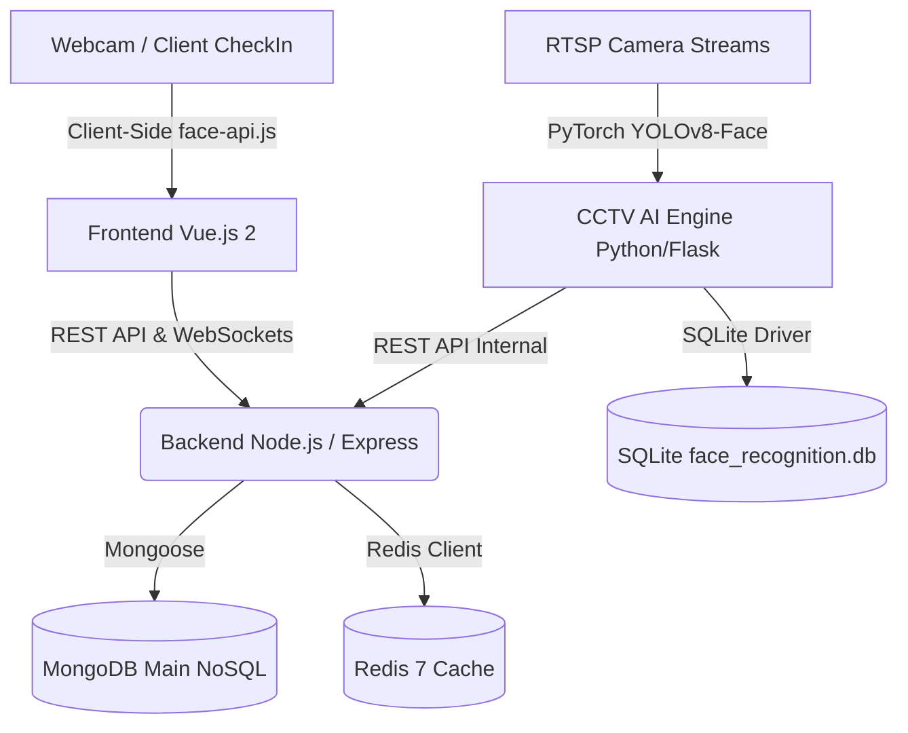

# 📋 สรุปรายงานระบบตรวจจับใบหน้าและบันทึกเวลาเข้าเรียนอัตโนมัติ
## Automated Recognition and Attendance System (A.R.A.S.)

---

## 📌 1. ข้อมูลโครงการ (Project Overview)

* **ชื่อโครงการ**: Automated Recognition and Attendance System (A.R.A.S.)
* **สถาบัน**: มหาวิทยาลัยแม่ฟ้าหลวง (Mae Fah Luang University - MFU)
* **สำนักวิชา / สาขาวิชา**: สำนักวิชาเทคโนโลยีสารสนเทศ / สาขาวิชาวิศวกรรมคอมพิวเตอร์ (ปีการศึกษา 2026)
* **วัตถุประสงค์หลัก**:
  1. ลดเวลาในการเช็คชื่อในห้องเรียนขนาดใหญ่ (>90%)
  2. ป้องกันการเช็คชื่อแทนกัน (Proxy Check-in)
  3. บันทึกและสรุปสถิติเข้าเรียนแบบ Real-Time ด้วยระบบตรวจจับใบหน้าผ่านกล้อง CCTV และ Webcam
  4. ทำงานสอดคล้องกับกฎหมายคุ้มครองข้อมูลส่วนบุคคล (PDPA) และระบบความปลอดภัย IAM ของ มฟล.

---

## 🏗️ 2. สถาปัตยกรรมระบบ (System Architecture)

ระบบออกแบบในรูปแบบ **Containerized Microservices Architecture**:

### 🧩 องค์ประกอบหลัก (Core Components):
1. **Frontend (Vue.js 2 + CoreUI)**:
   * หน้าจอบริหารจัดการ, Dashboard สรุปผล, สลับภาษา TH/EN (`vue-i18n`)
   * ระบบเช็คชื่อและลงทะเบียนใบหน้าผ่านกล้อง Webcam ด้วย `face-api.js`
2. **Backend (Node.js / Express)**:
   * ให้บริการ Central REST API (`/api/v1`)
   * จัดการสิทธิ์การใช้งาน (IAM RBAC), ยืนยันตัวตน, และออกรายงาน Attendance Log
3. **CCTV AI Engine (Python 3.10 / Flask)**:
   * ประมวลผลสตรีมวิดีโอ RTSP จากกล้อง CCTV ด้วย YOLOv8-Face และ `facenet-pytorch`
   * ระบบคำนวณ Majority Voting เพื่อความเสถียรของกรอบตรวจจับใบหน้า
4. **Database Ecosystem**:
   * **MongoDB 7**: ฐานข้อมูลหลักของระบบเว็บ (`StudentFace`, `AttendanceLog`, `accounts`)
   * **SQLite (`face_recognition.db`)**: Local High-Speed Cache สำหรับฝั่ง Python CCTV AI Engine (`known_faces`, `face_detections`, `blacklist`, `daily_stats`, `detection_settings`)
   * **Redis 7**: In-memory session store & cache acceleration

---

## 🔑 3. ฟีเจอร์และนวัตกรรมสำคัญ (Key Innovations)

1. **PDPA-Compliant Image Purge Engine**:
   * เมื่อนักศึกษาลงทะเบียนใบหน้า ระบบจะสกัดคุณลักษณะใบหน้าเป็นเวกเตอร์คณิตศาสตร์ (128-d/512-d Embeddings) และทำการ **ลบไฟล์ภาพถ่ายต้นฉบับออกจากดิสก์ทันที** เพื่อคุ้มครองข้อมูลส่วนบุคคลตามกฎหมาย PDPA
2. **Identity Stabilization (Majority Voting Algorithm)**:
   * ใช้อัลกอริทึม Majority Voting ($N=7, K \ge 4$) ในสตรีมวิดีโอเพื่อกำจัดการกระพริบ (Flickering) ของชื่อและลดการเกิด False Positive ในสตรีมกล้อง CCTV
3. **Dynamic Bilingual UI (TH/EN) & Data Preservation**:
   * รองรับการสลับภาษาบน UI แบบตอบสนองทันที พร้อมรักษารูปแบบ raw string ของสำนักวิชาทั้ง 15 แห่งใน MongoDB
4. **Institutional Security & IAM Integration**:
   * เชื่อมต่อกับระบบยืนยันตัวตน MFU SSO, กำหนดสิทธิ์การใช้งานผ่าน Permission Matrix, และมีระบบ Regex Parsing สำหรับ 2FA OTP

---

## 🗺️ 4. แผนผังเส้นทางระบบ (Routes Summary)

### 🟢 Backend API Mount Points (`/api/v1`)
| API Mount Path | Module Path | หน้าที่และรายละเอียด |
|---|---|---|
| `/automatedrecognitionandattendancesystem` | `Project/automatedrecognitionandattendancesystem/*.routes.js` | เวิร์กโฟลว์หลักของระบบ |
| `/attendance` | `Project/attendance/*.routes.js` | บันทึกประวัติเช็คชื่อ, ดึงข้อมูลย้อนหลัง, สถิติต่างๆ |
| `/cctv` | `Project/cctv/*.routes.js` | สตรีมกล้อง RTSP, เชื่อมต่อกับ Python AI Engine |
| `/security` | `Project/security/*.routes.js` | จัดการสิทธิ์ IAM, Roles, Permission Matrix, Audit Log |
| `/setting` | `Project/settings/*.routes.js` | การตั้งค่าระบบ, การแจ้งเตือนผ่าน Email, สำรองฐานข้อมูล |
| `/*` (Root) | `Project/accounts/*.routes.js` | ยืนยันตัวตน (`/signin`), ข้อมูลผู้ใช้ (`/auth/me`) |

### 🔵 Frontend Router Key Paths (`frontend-vue/src/router/index.js`)
| Route Path | Component Name | Required Permission | รายละเอียด |
|---|---|---|---|
| `/dashboard` | `Dashboard` | `/dashboard` | หน้าสรุปผล Dashboard |
| `/accounts/directory/register` | `AccountRegister` | `/accounts/directory` | ฟอร์มลงทะเบียนใบหน้านักศึกษา |
| `/accounts/directory/check-in` | `AccountCheckIn` | `/accounts/directory` | ระบบเช็คชื่อผ่าน Webcam |
| `/directory/cctv/viewer` | `CctvViewer` | `/accounts/directory` | หน้าจอมอนิเตอร์กล้อง CCTV Real-Time |
| `/security/permissions/matrix` | `PermissionMatrix` | `/security/permissions/matrix` | ตารางจัดการสิทธิ์สอดคล้อง IAM |
| `/security/audit` | `AuditExplorer` | `/security/audit` | ตรวจสอบ Audit Logs ของระบบ |

---

## ⚡ 5. พอร์ตและการเชื่อมต่อเครือข่าย (Network Ports Summary)

| Port | Service | Connection Binding | หน้าที่ |
|---|---|---|---|
| **6379** | Redis 7 | `127.0.0.1:6379` | Session & Fast Cache |
| **27017** | MongoDB 7 | Internal Docker Net | Primary Persistent Database |
| **8095** | Node.js Backend | `127.0.0.1:8095 -> 8082` | Central REST API Service |
| **5000** | Python CCTV Engine | `127.0.0.1:5000` | RTSP AI Face Detection & Recognition |
| **8086** | Vue.js Frontend | `127.0.0.1:8086 -> 80` | Web User Interface (Nginx) |

---

> [!NOTE]
> รายงานฉบับเต็มสามารถดูได้ที่ไฟล์ [`docs/markdown.md`](file:///d:/automated-recognition-and-attendance-system/docs/markdown.md) 
> และแผนผังสถาปัตยกรรมฉบับละเอียดอยู่ที่ [`docs/SYSTEM-MAP.md`](file:///d:/automated-recognition-and-attendance-system/docs/SYSTEM-MAP.md)
