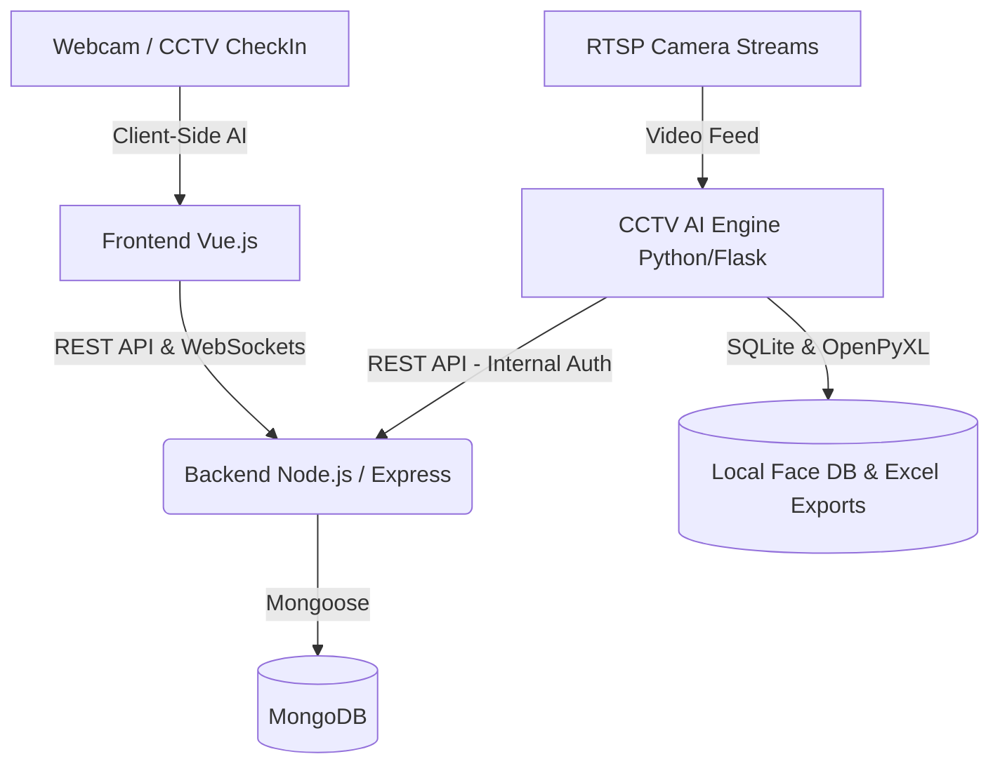

# System Architecture & Route Map

This document serves as a comprehensive mapping of the **Automated Recognition and Attendance System**. It outlines the high-level architecture, backend API endpoints, and frontend routes.

---

## 1. High-Level System Architecture

The system follows a microservice-inspired architecture designed to integrate facial recognition AI with standard web application workflows.

### Key Components:
- **Frontend (Vue.js 2 + CoreUI)**: Provides the administrative dashboard, student enrollment, manual check-in (using `face-api.js`), and CCTV viewers.
- **Backend (Node.js/Express)**: Handles business logic, IAM authorization, attendance tracking, and synchronization of data.
- **CCTV AI Engine (Python/Flask)**: Connects to RTSP streams, performs heavy AI facial recognition using PyTorch/OpenCV, and pushes results to the backend.
- **Database**: MongoDB (via Mongoose) serves as the primary datastore for the system.

---

## 2. Backend Route Map

All backend routes are mounted centrally in `backend-node/server/routes/app.routes.js`.

### Base Path: `/api/v1`

| Mount Point | Module Location | Purpose |
|---|---|---|
| `/automatedrecognitionandattendancesystem` | `Project/automatedrecognitionandattendancesystem/*.routes.js` | Core project business workflows and specific system functions. |
| `/setting` | `Project/settings/*.routes.js` | Application configurations, email settings, backups, and runtime access. |
| `/security` | `Project/security/*.routes.js` | Permission management, IAM roles, groups, and audit logs. |
| `/cctv` | `Project/cctv/*.routes.js` | Endpoints to synchronize camera streams, models, and embeddings with the Python Engine. |
| `/attendance` | `Project/attendance/*.routes.js` | Attendance logging, check-in history, reporting, and statistics. |
| `/*` (Root) | `Project/accounts/*.routes.js` | Identity management, authentication (/signin, /auth/me), and directory logic. |

---

## 3. Frontend Route Map

Frontend routing is managed in `frontend-vue/src/router/index.js` and secured by route `meta.permission` configurations which cross-reference the Vuex Security store.

| Route Path | Component Name | Required Permission Path | Description |
|---|---|---|---|
| `/dashboard` | `Dashboard` | `/dashboard` | Main summary dashboard. |
| `/automated-recognition-and-attendance-system/registry` | `AUTOMATEDRECOGNITIONATTENDANCESYSTEMATTENDANCESYSTEMRegistry` | `/automated-recognition-and-attendance-system/registry` | Core registration workflows. |
| `/operations/business` | `BusinessOperations` | `/operations/business` | Business operational workflows. |
| `/accounts/directory` | `AccountDirectory` | `/accounts/directory` | User and Student account management directory. |
| `/accounts/directory/check-in` | `AccountCheckIn` | `/accounts/directory` | Web-based manual check-in with local webcam. |
| `/accounts/directory/register` | `AccountRegister` | `/accounts/directory` | Student face/account enrollment form. |
| `/directory/cctv` | `DirectoryCCTV` | `/accounts/directory` | CCTV Configuration directory. |
| `/directory/cctv/viewer` | `CctvViewer` | `/accounts/directory` | Live RTSP streaming and event monitoring. |
| `/security/permissions/menu` | `CreateMenu` | `/security/permissions/menu` | IAM Menu configurations. |
| `/security/permissions/group` | `CreateGroup` | `/security/permissions/group` | IAM Role/Group creations. |
| `/security/permissions/matrix` | `PermissionMatrix` | `/security/permissions/matrix` | Granular permission assignment. |
| `/security/audit` | `AuditExplorer` | `/security/audit` | System audit logs viewer. |
| `/config/message-authen` | `SettingMessageAuthen` | `/config/message-authen` | Verification message authentication settings. |
| `/config/email-notifications` | `EmailNotifications` | `/config/email-notifications` | SMTP and email templates. |
| `/config/workflow-actions` | `WorkflowActions` | `/config/workflow-actions` | System workflows. |
| `/config/runtime-access` | `RuntimeAccess` | `/config/runtime-access` | Active sessions and access control. |
| `/config/database-backup` | `DatabaseBackup` | `/config/database-backup` | Database backup and restoration. |
| `/config/setting-message` | `SettingMessage` | `/config/setting-message` | System message configuration. |
| `/config/verification` | `SettingVerification` | `/config/verification` | Verification configuration settings. |
| `/setting/group` | `SettingGroup` | `/setting/group` | Setting group administration. |
| `/setting/message-status` | `SettingMessageStatus` | `/setting/message-status` | Message transmission status monitor. |

### Public Pages
- `/pages/login`: Login portal via IAM.
- `/pages/403`: Access Denied.
- `/pages/404`: Page Not Found.
- `/pages/500`: Internal Server Error.

---

## 4. Documentation Map (Docs Directory)

| File / Directory | Purpose |
|---|---|
| `docs/prd/` | Product Requirements Documents (PRD) detailing all features (e.g., Check-in, Web Enrollment). |
| `docs/agents/` | Behavior rules and context for specific AI roles (e.g., Frontend, Backend, Orchestrator). |
| `docs/tasks/` | Active execution records and task list tracking (System Progress). |
| `docs/AI-WORKFLOW.md` | The core workflow, rules, and delivery gates for this project. |
